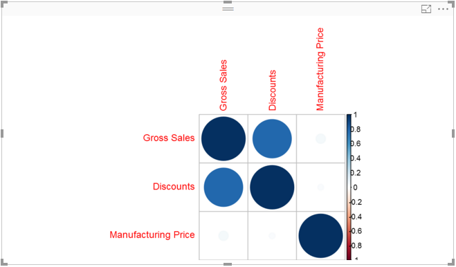

# Editing the R Script
When creating a R Powered Custom Visual, the template "rvisual" creates a file in the root folder of the visual called "script.r".
This file will hold the R script you want to execute to generate the image the user will see.

In this stage, we will change the default R script to start using the Corrplot package.
We will follow the corrplot [introduction](https://cran.r-project.org/web/packages/corrplot/vignettes/corrplot-intro.html) from cran.r-project.org

## Editing the R Script
Open the "script.r" file and paste the following code:

```r
library(corrplot)
M <- cor(Values)
corrplot(M, method="circle")
```

Now add the `corrplot` package to the CRAN dependencies of this visual in the `dependencies.json` file:
```json
{
  "cranPackages": [
    {
      "name": "corrplot",
      "displayName": "corrplot",
      "url": "https://cran.r-project.org/web/packages/corrplot/"
    }
  ]
}
```

Now you can package the visual and try it out (or you can use the `pbiviz start` feature to debug the visual in PowerBI.com)



See [commit](https://github.com/Microsoft/PowerBI-visuals-sampleCorrPlotRVisual/commit/19f587c499511a19533dfedd86a25f0707f375a8) for what was added at this step.