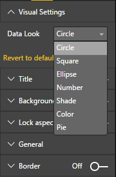
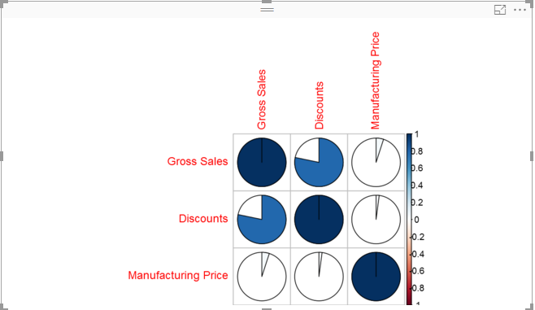

# Controlling the R Script from the Property Pane
In order to enhance the behavior of the R Script based on user input, one can add properties to the property pane.
This way users will be able to control the visual to get to the exact look and feel they want

## Adding enumeration property
Corrplot can be easily configured using the `method` argument for the `corrplot` function.
Our default script just used `circle`, but we can expose this property to the user and have her choose between the options.

### Defining the enumeration property for controlling the `method` argument
First, we need to define the object and property in the `capabilities.json` file.
We need to define the object named `settings` and in this object we will define a property named `method` with the type `enumeration`
and we will supply the valid values for this property
```json
    "settings": {
      "displayName": "Visual Settings",
      "description": "Settings to control the look and feel of the visual",
      "properties": {
        "method": {
          "displayName": "Data Look",
          "description": "Control the look and feel of the data points in the visual",
          "type": {
            "enumeration": [
              {
                "displayName": "Circle",
                "value": "circle"
              },
              {
                "displayName": "Square",
                "value": "square"
              },
              {
                "displayName": "Ellipse",
                "value": "ellipse"
              },
              {
                "displayName": "Number",
                "value": "number"
              },
              {
                "displayName": "Shade",
                "value": "shade"
              },
              {
                "displayName": "Color",
                "value": "color"
              },
              {
                "displayName": "Pie",
                "value": "pie"
              }
            ]
          }
        }
      }
    }
```
### Exposing the property to the users in the property pane
In order for the above property to be exposed in the property pane, we will need to change the TypeScript code as well.
Open the `src/visual.ts` file and start editing it

 In the `visual.ts` file we have added several code snippets as comments, so you can start from there.

 First, let's define a new interface to hold the property value. We will hold the enumeration value in this property

```typescript
interface VisualSettings {
    method: string;
}
```

Now, let's define a member property with this type

```typescript
private settings: VisualSettings;
```

Now, change the `updateObjects` method to get the value of the enumeration:

```typescript
public updateObjects(objects: DataViewObjects) {
    this.settings = <VisualSettings>{
        method: getValue<string>(objects, 'settings', 'method', "circle")
    };
}
```

Now, we need to write the code in `enumerateObjectInstances` to let the system know that we want to show the property in the property pane:

```typescript
public enumerateObjectInstances(options: EnumerateVisualObjectInstancesOptions): VisualObjectInstanceEnumeration {
    let objectName: string = options.objectName;
    let objectEnumeration: VisualObjectInstance[] = [];

    switch( objectName ) {
        case 'settings':
            objectEnumeration.push({
                objectName: objectName,
                properties: {
                    method: this.settings.method,
                    },
                selector: null
            });
            break;
    };

    return objectEnumeration;
}
```

The last thing we need to take care of is the actual R script to start using this property
We need to handle the case where we don't get any value for this property. This happens when the user makes no changes in the property pane.
The naming convention of the R runtime variables for the properties is as follows:

`<objectname>_<propertyname>`

In our case, the name will be `settings_method`

```r
if (!exists("settings_method"))
{
    settings_method = "circle";
}

library(corrplot)
M <- cor(Values)
corrplot(M, method=settings_method)
```

The result:




See [commit](https://github.com/Microsoft/PowerBI-visuals-sampleCorrPlotRVisual/commit/00870919ebe8a2f8a4fa8c4550f8a19ccd5639ed) for what was added at this step.