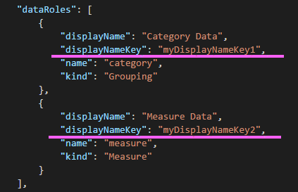

#Getting Locale in Custom Visuals 

Visuals can now know PowerBI's locale, so they can display localized information
(read more about [Supported languages and countries/regions for Power BI](https://powerbi.microsoft.com/en-us/documentation/powerbi-supported-languages/))

For example, getting locale in the sample BarChart.


Each of these bar charts was created under different locale (English, Basque and Hindi), and it is displayed in the tooltip.

##Getting the `locale`

The 'locale' is passed as a string during the initialization of the visual. If a locale is changed in PowerBI the visual will be generated again with the new locale.
You can find the full sample code at [SampleBarChart with Locale](https://github.com/Microsoft/PowerBI-visuals-sampleBarChart/commit/388670c71a873bf7412e771164ea3cbb8522a63e)

The BarChart contructor now has a `locale` member which is instantiated in the constructor with the host `locale` instance.

```typescript
    private locale: string;
    ...
    this.locale = options.host.locale;
```

### Supported Locales
Locale string | Language
--------------|----------------------
ar-SA | العربية (Arabic)
bg-BG | български (Bulgarian)
ca-ES | català (Catalan)
cs-CZ | čeština (Czech)
da-DK | dansk (Danish)
de-DE | Deutsche (German)
el-GR | ελληνικά (Greek)
en-US | English (English)
es-ES | español service (Spanish)
et-EE | eesti (Estonian)
eU-ES | Euskal (Basque)
fi-FI | suomi (Finnish)
fr-FR | français (French)
gl-ES | galego (Galician)
he-IL | עברית (Hebrew)
hi-IN | हिन्दी (Hindi)
hr-HR | hrvatski (Croatian)
hu-HU | magyar (Hungarian)
id-ID | Bahasa Indonesia (Indonesian)
it-IT | italiano (Italian)
ja-JP | 日本の (Japanese)
kk-KZ | Қазақ (Kazakh)
ko-KR | 한국의 (Korean)
it-LT | Lietuvos (Lithuanian)
lv-LV | Latvijas (Latvian)
ms-MY | Bahasa Melayu (Malay)
nb-NO | norsk (Norwegian)
nl-NL | Nederlands (Dutch)
pl-PL | polski (Polish)
pt-BR | português (Portuguese)
pt-PT | português (Portuguese)
ro-RO | românesc (Romanian)
ru-RU | русский (Russian)
sk-SK | slovenský (Slovak)
sl-SI | slovenski (Slovenian)
sr-Cyrl-RS | српски (Serbian)
sr-Latn-RS | srpski (Serbian)
sv-SE | svenska (Swedish)
th-TH | ไทย (Thai)
tr-TR | Türk (Turkish)
uk-UA | український (Ukrainian)
vi-VN | tiếng Việt (Vietnamese)
zh-CN | 中国 (Chinese-Simplified)
zh-TW | 中國 (Chinese-Tranditional)

#Localizing the property pane in Custom Visuals

The different property pane fields you entered in your capabilities can now be localized to provide a more integrated experience,
making your custom visual seem like any other core visual.

For example, a non-localized custom visual created using the "pbiviz new" command will show the following fields in the property pane:


both the Category Data and the Measure Data are defined in the capabilities.json file as displayName.


#How To Localize your capabilities

First add a display name key to every display name you want to localize in your capabilities.
in our example:


Then add a directory called "stringResources", this directory will contain all your different string resource files based on the locales you want your visual to support.
under this directory you'll need to add a JSON file for every locale you want to support that contains the locale information and the localized strings values for every displayNameKey you want to replace.

In our example, lets say we want to support Arabic and Hebrew.
we will need to add two JSON files in the following way:


Every JSON file we add will define the locale (this has to be one of the locales from the supported list above),
and the string values for the wanted display name keys.
In our example the Hebrew string resource file will look like this:


After adding all the string resource files you'll need to add the path to your files in the pbiviz.json:


The resulting property pane will contain the displayName according to the string resources files you defined
in our example in case we change the language to Hebrew we will get the following property pane:

