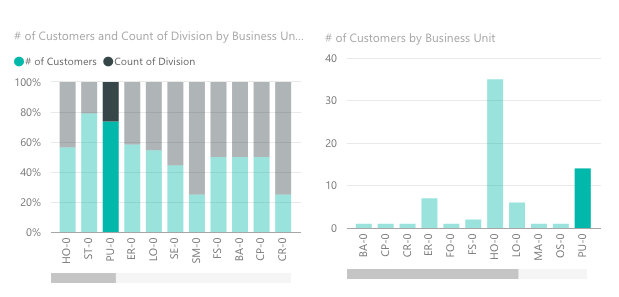

#Visual

This document contains a high level overview of the most basic custom visual implementation with links to documents that contain more detailed information about each component.

The basic structure of a visual is a class that implements `IVisual` wrapped in a module that is namespaced to allow access to the APIs interfaces. The API version utilized by your visual depends on the version of the d.ts file referenced in your project. 

##Module

To ensure access to all of the correct api interfaces your visual must be created in the `powerbi.extensiblity.visual` namespace.

```typescript
module powerbi.extensiblity.visual {
    //create your visual (class) here
}
```

##Visual class / IVisual

All visuals start with a class that implements the `IVisual` interface. You can name the class whatever you'd like, but there must be *exactly one* class that implements the `IVisual` interface.

**Note:** your visual class name must match what is defined in your `pbiviz.json` file.

```typescript
class MyVisual implements IVisual {
    
    constructor(options: VisualConstructorOptions) {
        //one time setup code goes here (called once)
    }
    
    public update(options: VisualUpdateOptions): void {
        //code to update your visual goes here (called on all view or data changes)
    }

    public enumerateObjectInstances(options: EnumerateVisualObjectInstancesOptions): VisualObjectInstanceEnumeration {
        //returns objects to populate the property pane (called for each object defined in capabilities)
    }
    
    public destroy(): void {
        //one time cleanup code goes here (called once)
    }
}
```

[Learn more about IVisual Api](IVisualApi.md)

## Visual Selection

Visuals can allow the user to select data points or categories by clicking them with the mouse.
Visual selection can be used to filter and behave with other visuals.



[Learn more about Visual Selection](Selection.md)